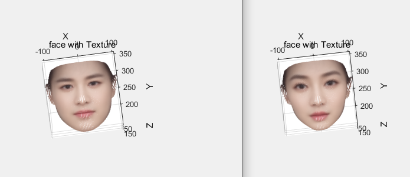
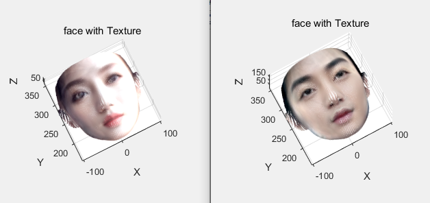
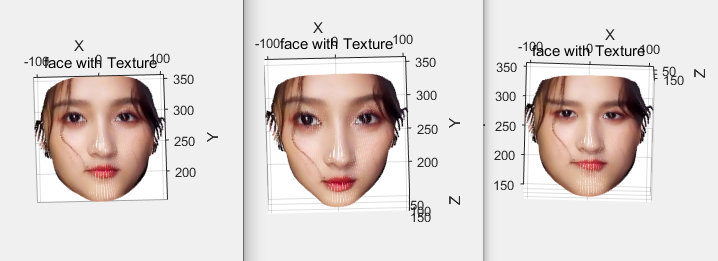
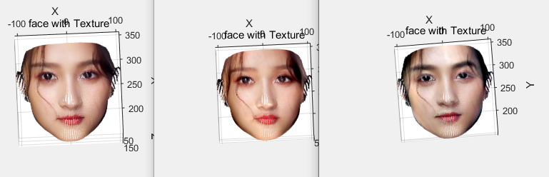

# 3Dface_pca
一种高自由度的捏脸方法：使用PRNet获取任意想要获取的人脸数据（可用于数据分析或作为捏脸的数据基），pca分析人脸3D模型顶点以及纹理，得出主成分向量，控制主成分向量与人脸模型相加，可分别捏人脸轮廓以及人脸纹理。

**使用方法：**

1.使用自己的人脸照片（无尺寸和数量要求）或者从免费的[人脸数据库](http://www.seeprettyface.com/mydataset.html)下载。

2.运行[PRNet](https://github.com/YadiraF/PRNet)项目。

3.运行环境为anconda3下安装tensorflow,numpy>=1.14.3 scikit-image scipy dlib 执行环境为jupyter 运行demo.py生成自己想要的数据，run demo.py -i input -o output  --isDlib True  --is3d
True --isFront True在运行时 一定需要加上--isFront True保证生成的三维模型都是同一个方向，不同模型之间不存在旋转。其他参数的具体说明，可用run demo.py --help查看
  
4.运行face_pca.m文件对生成的obj文件中的顶点数据进行pca分析，得到主成分向量，以及平均人脸。通过公式“捏得的人脸=平均人脸+系数×主成分向量1+系数×主成分向量2+...” 捏得新的人脸。同样的方式对obj
文件里的纹理进行分析。face_pca.mat是我分析53个中国女星和38个中国男星的顶点和纹理数据得到的主成分数据。

5.face_model.m文件 可使用分析好的数据，通过调节参数捏脸，两组参数分别对应了人脸的轮廓和人脸的纹理。

**备注**

MorphableModel.mat是分析的扫描得到的国外人脸数据（100个男性人脸和100个女性人脸）face_zxy.mat是分析使用PRNet网络获取的数据（包含53个女明星人脸和38个男明星人脸），在实际应用中最好重新获取希望分析的数据。

**捏脸效果**

*捏轮廓（数据集的平均人脸顶点）*

*捏纹理（数据集的平均人脸纹理）*

*捏特定的人脸轮廓（关晓彤）*

*捏特定的人脸纹理（关晓彤）*
